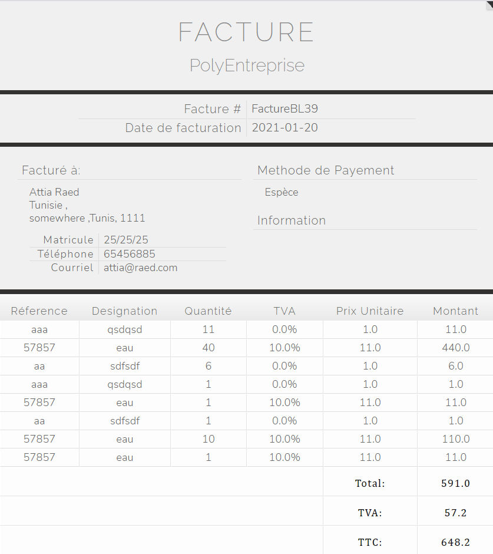

**# GestionAchatsVentes**
using JAVA , Swing management purchase sales ,gestion achats et ventes d'une entreprise

## Important

**Created with:**

intelliJ idea

**java jdk 15.0.1**

**mysql database**

##### **you need to add my sql connector to your libraries (version used 8.0.21)**

database connection file under "src/database/Connect"

##### dummy database mysqldummydata/dummybase.sql

### **mysql dummy data needs to be imported to create the tables**

(entreprise table needs to be filled with one row )

### **Models:**

Client and Fournisseur are basically the same so i created one model "Client.java" for both
(should've been partner :p) but are separated in controller and how the quantity of products change

## Views :

**Main View**

**Fournisseur**

**Client**

**Verification:**

**Product:**

**Achat:**

**Facture with html and css :**

